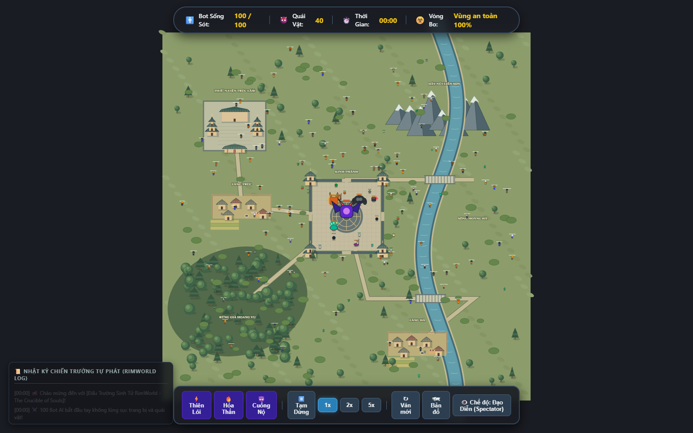

# AutoBaro

Game mô phỏng sinh tồn Battle Royale trên trình duyệt, lấy cảm hứng từ phong cách hoạt hình RimWorld và thế giới võ hiệp kỳ ảo. Quan sát 100 bot tự quyết định cách chiến đấu, săn quái, nhặt trang bị và tranh vị trí người sống sót cuối cùng; hoặc trực tiếp điều khiển một nhân vật.

Dự án dùng **JavaScript thuần, Canvas 2D và Vite**. Nhân vật, địa hình, kiến trúc và hiệu ứng được vẽ bằng code, không cần backend để chạy.



## Các tính năng hiện có

- AI theo tính cách và cảm xúc: chọn mục tiêu, tìm đường, săn quái, nhặt đồ, chạy trốn và lập liên minh. Bảng thông tin cho biết suy nghĩ, mục tiêu hiện tại, EXP, trang bị và cooldown kỹ năng.
- Nhiều kiểu đánh theo vũ khí, với động tác chuẩn bị, ra đòn, hồi chiêu, đỡ và né. Kỹ năng có giới hạn tài nguyên, cooldown và hiệu ứng cảnh báo.
- Mỗi trận có 100 bot và 40 quái: 20 Lâu La, 10 Yêu Thú, 6 Yêu Tướng, 3 Yêu Vương, 1 Yêu Thần.
- Cụm giao tranh tối đa 3 thực thể; hai cặp liên minh có thể giao tranh với 4 thành viên.
- Bản đồ 5200 × 5200 có Thiền Viện Trúc Lâm, Rừng Già Hoang Vu, Dãy Núi Liên Sơn, Sông Hoàng Hà, Kinh Thành và làng mạc. Nhà, tường, hàng rào, cây và đá có va chạm; AI ưu tiên đường khô và cầu. Trong sông chỉ bơi, tốc độ còn 45% và không thể chiến đấu.
- Vùng an toàn thu còn 50% / 25% / 10% diện tích bản đồ khi còn 20 / 10 / 5 bot.
- Khi chỉ còn một bot, popup công bố kết quả. Đóng popup để tiếp tục: người sống sót tìm Yêu Thần nếu boss còn sống. Có nút **Ván mới** trên thanh công cụ.
- Cấp tối đa 15; cấp 10 có hào quang vàng, cấp 15 có hào quang tím bạc và tia điện. Bot có biểu cảm và biểu tượng cảm xúc.

## Luật phần thưởng và hồi máu

Bot kết liễu bot nhận ngẫu nhiên **50% lên một cấp, 50% rơi một món trang bị/vũ khí**. Bot cấp 15 luôn nhận nhánh rơi đồ. Bậc món đồ dựa trên trang bị cao nhất của người tử trận: 80% cùng bậc, 20% cao hơn một bậc, tối đa Thần Khí; tay không tính là bậc Thường. Quái hoặc nhân vật do người chơi điều khiển kết liễu không nhận phần thưởng đặc biệt này.

Lâu La / Yêu Thú / Yêu Tướng có tỷ lệ rơi đồ 20% / 30% / 40%, mỗi lần chỉ một bình máu hoặc một món trang bị/vũ khí. Yêu Vương và Yêu Thần luôn rơi một bình máu cùng một món trang bị/vũ khí. Không có trang bị rải sẵn ngẫu nhiên hay hòm thính.

HP không tự hồi theo thời gian. Hồi máu bằng lên cấp, bình máu nhặt được hoặc kỹ năng có tác dụng hồi máu.

## Chạy trên máy

Cần Node.js 18 hoặc từ 20 trở lên và npm, theo yêu cầu của Vite 5. Clone repo rồi chạy:

```sh
npm ci
npm run dev
```

Mở địa chỉ mà Vite hiển thị trong terminal.

| Lệnh | Chức năng |
| --- | --- |
| `npm test` | Chạy kiểm thử logic game bằng Node.js |
| `npm run build` | Tạo bản production trong thư mục `dist/` |
| `npm run preview` | Chạy thử bản production sau khi build |

## Điều khiển

| Thao tác | Chế độ quan sát | Chế độ người chơi |
| --- | --- | --- |
| Kéo chuột trái | Di chuyển camera | — |
| WASD / phím mũi tên | Di chuyển camera | Di chuyển nhân vật |
| Click chuột trái | Xem thông tin bot/quái | Tấn công |
| Cuộn chuột | Phóng to / thu nhỏ | Phóng to / thu nhỏ |
| Q / E / R / F | — | Dùng kỹ năng đã mở khóa |
| Shift | — | Đỡ đòn |
| Space | Bật/tắt camera tự động | Né đòn |
| H | — | Uống bình máu |
| M | Bật/tắt bản đồ tổng | Bật/tắt bản đồ tổng |

Thanh công cụ cho phép đổi chế độ, tạm dừng, thay đổi tốc độ mô phỏng và bắt đầu ván mới.

## Cấu trúc source

- `index.html`, `css/`: giao diện game.
- `js/main.js`, `js/game.js`: nạp module, vòng lặp game và điều khiển.
- `js/ai/`: quyết định hành vi và cảm xúc.
- `js/engine/`: địa hình, tìm đường, camera, spatial hash và vòng bo.
- `js/entities/`: nhân vật, quái, giao tranh và phần thưởng.
- `js/renderer/`: vẽ nhân vật, vũ khí, quái và hiệu ứng.
- `js/data/`: dữ liệu tính cách, kỹ năng, quái và trang bị.
- `js/ui/`: thông tin thực thể, nhật ký và bảng điều khiển.
- `tests/`: kiểm thử tự động; `reports/`: báo cáo và ảnh kiểm chứng.

## Tài liệu và kiểm chứng

[Đặc tả dự án](requirement.md) và [dữ liệu thiết kế](material-game.md) mô tả định hướng ban đầu. Một số thông số đã được thay đổi theo các lần cập nhật; xem [báo cáo luật, địa hình và AI mới nhất](reports/world-rules-update-2026-10-07.md) để đối chiếu bản hiện tại.

Bản cập nhật gần nhất đã vượt qua 29 bài kiểm thử và build production; đã chạy thử trên Microsoft Edge với ba seed, kiểm tra va chạm, giới hạn giao tranh, camera, bảng EXP và nút Ván mới. Kết quả mô phỏng phụ thuộc tình huống: các người sống sót trong ba trận mẫu vẫn chưa hạ được Yêu Thần. Các hiệu ứng cấp 10/15 được kiểm tra riêng.


