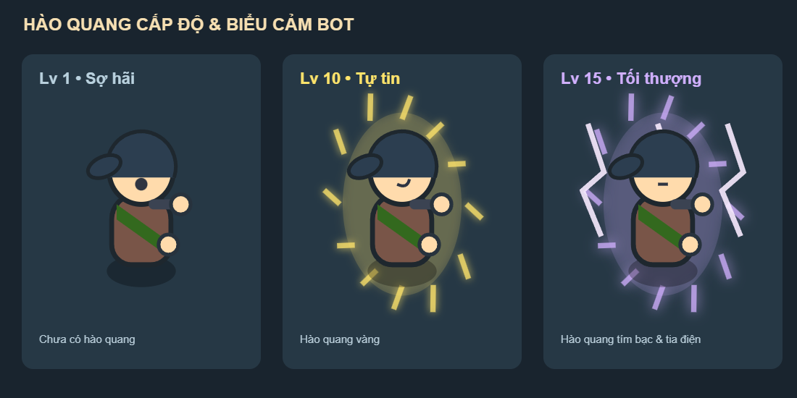

# AutoBaro

Game mô phỏng sinh tồn Battle Royale trên trình duyệt, lấy cảm hứng từ phong cách hoạt hình RimWorld và thế giới võ hiệp kỳ ảo. Quan sát 100 bot tự quyết định cách chiến đấu, săn quái, nhặt trang bị và tranh vị trí người sống sót cuối cùng; hoặc trực tiếp điều khiển một nhân vật.

Dự án dùng **JavaScript thuần, Canvas 2D và Vite**. Nhân vật, địa hình, kiến trúc và hiệu ứng được vẽ bằng code, không cần backend để chạy.


## Các tính năng hiện có

- Săn từ mức ước lượng thắng 50% khi tính cách/cảm xúc ủng hộ. Bot thăm dò, gây áp lực, giữ chiêu, lùi chiến thuật và phản công sau đỡ/né hoặc hồi động tác của địch; bot hơi yếu hơn vẫn tự vệ. Ước lượng xét chiêu sẵn sàng, tài nguyên, tầm đánh và địa hình. Truy đuổi có giới hạn thời gian/khoảng cách; mất dấu chỉ tìm quanh vị trí cuối trong 3 giây, không bắt lại cùng con mồi trong 20 giây.
- Hai bot yếu hơn có thể lập liên minh chống bot hạ ít nhất hai bot trong 60 giây, khi có người chứng kiến chuỗi hạ sát và cơ hội thắng của cả cặp từ 40%. Cặp chia sẻ vị trí cuối đã thấy, giải tán khi mất dấu, quá thời gian hoặc quá bất lợi; vẫn tuân thủ giới hạn combat.
- Nhặt đồ hữu ích ngay dưới chân và đổi kế hoạch để lấy nâng cấp an toàn. So trang bị theo sát thương/tốc đánh/tầm đánh/phòng thủ/HP/mana và tác dụng đặc biệt đang được hỗ trợ; tôn trọng khóa nhánh vũ khí, lấy được đồ ở sào huyệt đã dọn. Người sống sót chuẩn bị đồ và bình máu trước khi quyết chiến.
- AI theo tính cách và cảm xúc, với sáu chỉ số cá nhân: hiếu chiến, thận trọng, tham vọng, trung thành, kiên nhẫn và khám phá. Bot xuất phát ở rìa, đánh giá HP/ATK/DEF/trang bị để chọn con mồi, tìm đường, nhặt đồ, chạy trốn và lập liên minh. Bảng thông tin cho biết suy nghĩ, mục tiêu hiện tại, EXP, trang bị và cooldown kỹ năng.
- Mọi loài quái có dáng riêng; nhện 8 chân, khỉ, sói/báo, gấu, dơi, cua, ma cây, xà tinh và các bộ xương được phân biệt rõ. Vũ khí có lưỡi, chuôi, dây cung, tinh thể, trang sách và họa tiết theo phẩm chất; vật phẩm rơi dùng cùng hình vũ khí đang cầm.
- Quái chủ động phát hiện người chơi/bot trong tầm nhìn nếu không bị tường hoặc ẩn thân che khuất. Chúng áp sát trong giới hạn sinh cảnh và không tấn công sang điện thờ/sào huyệt khác. Khi focus, vòng vàng hiển thị tầm đánh thường; vòng xanh hiển thị tầm nhìn thật của đối tượng.
- Nhiều kiểu đánh theo vũ khí, với động tác chuẩn bị, ra đòn, hồi chiêu, đỡ và né. Kỹ năng có giới hạn tài nguyên, cooldown và hiệu ứng cảnh báo. Quái dùng chung nhịp phép: tối đa một phép mỗi 3 giây, ngoài cooldown riêng từng phép.
- Mỗi trận có 100 bot và 71 quái: 40 Lâu La (bầy 2–3 con), 20 Yêu Thú đơn lẻ, 6 Yêu Tướng, 4 Yêu Vương, 1 Yêu Thần. Quái có sinh cảnh theo loài; bốn Yêu Vương trấn giữ bốn sào huyệt đối xứng, Yêu Tướng canh bên ngoài và không đánh hội đồng một bot.
- Cụm giao tranh liên thông tối đa 3 thực thể; ngoại lệ đúng hai cặp liên minh với 4 thành viên. Kiểm tra di chuyển và chọn mục tiêu ngăn bot kéo tới tụ đám ở cụm đã đủ người.
- Bản đồ 5200 × 5200 có Thiền Viện Trúc Lâm, Rừng Già Hoang Vu, Dãy Núi Liên Sơn, Sông Hoàng Hà, Kinh Thành và làng mạc. Nhà, tường, hàng rào, cây và đá có va chạm; AI ưu tiên đường khô và cầu. Trong sông chỉ bơi, tốc độ còn 45% và không thể chiến đấu.
- Không còn vòng bo hoặc sát thương ngoài vùng. Điện thờ Yêu Thần có phong ấn chặn di chuyển và giao tranh, chỉ mở khi mọi Yêu Vương đang sống đã bị hạ. Lượt farm cuối khóa lại cho đến khi hạ hết cả 5 Yêu Vương mới.
- Khi chỉ còn một bot, popup công bố kết quả. Đóng popup để tiếp tục: quái từ Yêu Vương trở xuống được thay bằng 5 Yêu Vương khác nhau ở 5 vị trí; người sống sót farm EXP đến cấp 15 và hạ hết 5 Yêu Vương rồi mới chủ động đấu Yêu Thần. Có nút **Ván mới** trên thanh công cụ.
- Cấp tối đa 15; cấp 10 có hào quang vàng, cấp 15 có hào quang tím bạc và tia điện. Bot có biểu cảm và biểu tượng cảm xúc.

## Luật phần thưởng và hồi máu

Bot kết liễu bot luôn làm rơi một món: **75% món vũ khí nạn nhân đang cầm, 25% món ngẫu nhiên cao hơn một bậc**, tối đa Thần Khí. Không có vũ khí thì lấy giáp/mũ; không có trang bị thì sinh một món Thường hoặc Hiếm. EXP PvP bằng **60 × cấp nạn nhân**, không tự động tặng một cấp. Quái hoặc nhân vật do người chơi điều khiển kết liễu không tạo món thưởng đặc biệt này.

Lâu La / Yêu Thú / Yêu Tướng có tỷ lệ rơi đồ 20% / 30% / 40%, mỗi lần chỉ một bình máu hoặc một món trang bị/vũ khí. Yêu Vương và Yêu Thần luôn rơi một bình máu cùng một món trang bị/vũ khí. Không có trang bị rải sẵn ngẫu nhiên hay hòm thính.

HP không tự hồi theo thời gian. Hồi máu bằng lên cấp, bình máu nhặt được hoặc kỹ năng có tác dụng hồi máu.

## Chạy trên máy

Cần Node.js 18 hoặc từ 20 trở lên và npm, theo yêu cầu của Vite 5. Clone repo rồi chạy:

```sh
npm ci
npm run dev
```

Mở địa chỉ mà Vite hiển thị trong terminal.

| Lệnh | Chức năng |
| --- | --- |
| `npm test` | Chạy kiểm thử logic game bằng Node.js |
| `npm run build` | Tạo bản production trong thư mục `dist/` |
| `npm run preview` | Chạy thử bản production sau khi build |

## Điều khiển

| Thao tác | Chế độ quan sát | Chế độ người chơi |
| --- | --- | --- |
| Kéo chuột trái | Di chuyển camera | — |
| WASD / phím mũi tên | Di chuyển camera | Di chuyển nhân vật |
| Click chuột trái | Xem thông tin bot/quái | Tấn công |
| Cuộn chuột | Phóng to / thu nhỏ | Phóng to / thu nhỏ |
| Q / E / R / F | — | Dùng kỹ năng đã mở khóa |
| Shift | — | Đỡ đòn |
| Space | Bật/tắt camera tự động | Né đòn |
| H | — | Uống bình máu |
| M | Bật/tắt bản đồ tổng | Bật/tắt bản đồ tổng |

Thanh công cụ cho phép đổi chế độ, tạm dừng, thay đổi tốc độ mô phỏng và bắt đầu ván mới.

## Cấu trúc source

- `index.html`, `css/`: giao diện game.
- `js/main.js`, `js/game.js`: nạp module, vòng lặp game và điều khiển.
- `js/ai/`: quyết định hành vi và cảm xúc.
- `js/engine/`: địa hình, tìm đường, camera, spatial hash.
- `js/entities/`: nhân vật, quái, giao tranh và phần thưởng.
- `js/renderer/`: vẽ nhân vật, vũ khí, quái và hiệu ứng.
- `js/data/`: dữ liệu tính cách, kỹ năng, quái và trang bị.
- `js/ui/`: thông tin thực thể, nhật ký và bảng điều khiển.
- `tests/`: kiểm thử tự động; `reports/`: báo cáo và ảnh kiểm chứng.

## Tài liệu và kiểm chứng

[Đặc tả dự án](requirement.md) và [dữ liệu thiết kế](material-game.md) mô tả định hướng ban đầu. Một số thông số đã được thay đổi theo các lần cập nhật; xem [báo cáo luật, địa hình và AI trước đó](reports/world-rules-update-2026-10-07.md) để đối chiếu bản hiện tại.

Xem [báo cáo combat, liên minh và nhặt đồ](reports/combat-coalition-loot-2026-10-08.md) cho lượt cập nhật mới nhất. [Báo cáo chiến thuật, phong ấn và hình ảnh](reports/tactics-visual-update-2026-10-08.md) ghi nhận lượt cập nhật trước. [Báo cáo sinh cảnh, tính cách và lượt farm cuối](reports/habitat-ai-update-2026-10-07.md) ghi nhận phiên bản trước. Các báo cáo cũ được giữ lại để đối chiếu những phiên bản trước.


