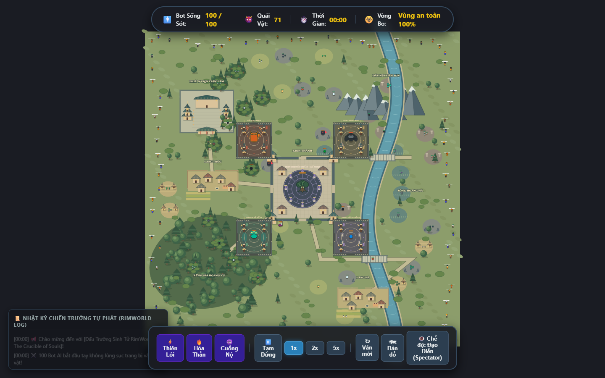
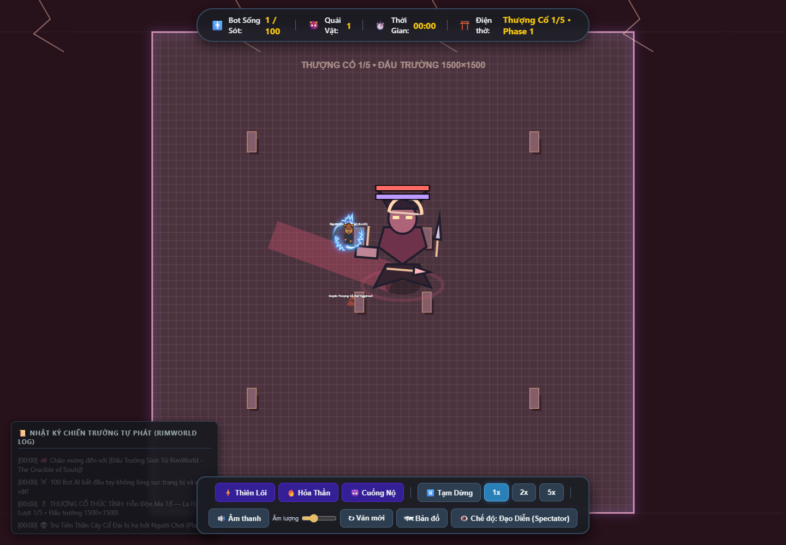
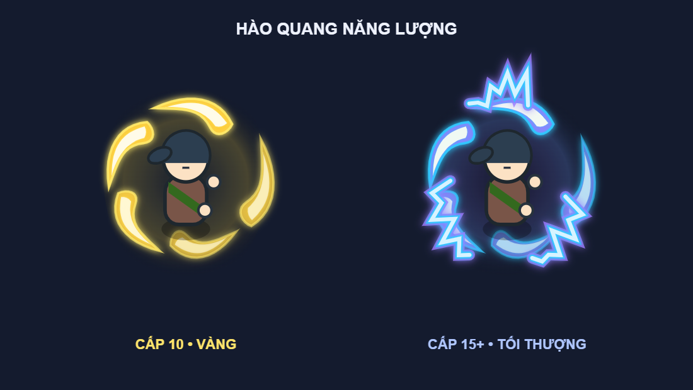

# AutoBaro

Game mô phỏng sinh tồn Battle Royale trên trình duyệt, lấy cảm hứng từ phong cách hoạt hình RimWorld và thế giới võ hiệp kỳ ảo. Quan sát 100 bot tự quyết định cách chiến đấu, săn quái, nhặt trang bị và tranh vị trí người sống sót cuối cùng; hoặc trực tiếp điều khiển một nhân vật.

Dự án dùng **JavaScript thuần, Canvas 2D và Vite**. Nhân vật, địa hình, kiến trúc và hiệu ứng được vẽ bằng code, không cần backend để chạy.



## Các tính năng hiện có

- Săn từ mức ước lượng thắng 50% khi tính cách/cảm xúc ủng hộ. Bot thăm dò, gây áp lực, giữ chiêu và phản công sau đỡ/né hoặc hồi động tác của địch. Chênh cấp không còn là lý do từ chối: chủ động vẫn cần ước lượng từ 50%, nhưng bị đánh, bị cướp mạng, bị cướp đồ, đánh lén hoặc thấy bot còn từ 30% máu thì vào trận. Đang thắng thì không đổi mục tiêu; việc mới được ghi nhớ sau. Nếu đang đánh A mà B tấn công mình thì quay sang B, và giữ B cho đến khi có đòn mới hơn. Sau khi mất 25% HP tối đa của trận đó mà ước lượng dưới 40% và còn đường lui thì rút. Hết đường thì đánh đến chết, kể cả bot hèn nhát. Khi chưa có con mồi, bot tuần tra các khu vực và đường giao nhau thay vì đứng một chỗ. Mất dấu chỉ tìm quanh vị trí cuối trong 3 giây.
- Khi còn 2–5 bot, chúng ưu tiên truy tìm nhau và giữ đối thủ đến khi phân thắng bại hoặc đến mốc rút ở trên. Vẫn đỡ/né, dùng bình và giữ giới hạn 3 người hoặc 4 khi đúng hai cặp liên minh.
- Hai bot yếu hơn có thể lập liên minh chống bot hạ ít nhất hai bot trong 60 giây, khi có người chứng kiến chuỗi hạ sát và cơ hội thắng của cả cặp từ 40%. Khi cùng nhìn thấy một đối thủ mạnh hơn cả hai, hai bot gần nhau cũng dễ bắt tay hơn nếu cơ hội cả cặp đạt 40%. Cặp chia sẻ vị trí cuối đã thấy, giải tán khi mất dấu, quá thời gian hoặc quá bất lợi; vẫn tuân thủ giới hạn combat.
- Nhặt đồ hữu ích ngay dưới chân, kể cả đang ra đòn; ưu tiên vũ khí mạnh hơn trong 220 px, có đường khô thông thoáng và tiếp cận được trong 3 giây, kể cả trong combat. Giữ kế hoạch chiến đấu và vũ khí đã chốt cho đòn đang đánh. So trang bị theo sát thương/tốc đánh/tầm đánh/phòng thủ/HP/mana và tác dụng đặc biệt đang được hỗ trợ; đổi sang mọi loại vũ khí mạnh hơn mà vẫn giữ kỹ năng đã học, lấy được đồ ở sào huyệt đã dọn. Người sống sót chuẩn bị đồ và bình máu trước khi quyết chiến.
- Bot dùng 32 kỹ năng chủ động đã cân bằng lại, mỗi kỹ năng có 3 bậc. Học và nâng theo sở thích cá nhân: nhiều kỹ năng bậc thấp hoặc ít kỹ năng bậc cao; không khóa nhánh, không giới hạn 4 kỹ năng cho AI. Đòn nhiều đợt, chảy máu, phản kiếm, phá giáp, khiên mana và hồi máu có hiệu lực thật; bot dùng tối đa một kỹ năng mỗi 1.8 giây, ngoài cooldown riêng.
- AI theo tính cách và cảm xúc, với tám chỉ số cá nhân: hiếu chiến, thận trọng, tham vọng, trung thành, kiên nhẫn, khám phá, hèn nhát và bình tĩnh. Bot xuất phát ở rìa, đánh giá HP/ATK/DEF/trang bị để chọn con mồi, tìm đường, nhặt đồ, chạy trốn và lập liên minh. Bảng thông tin cho biết suy nghĩ, mục tiêu, chiến ý, lý do quyết định, thời gian giữ kế hoạch, EXP, ATK/DEF, trang bị và cooldown kỹ năng.
- Mọi loài quái có dáng riêng; nhện 8 chân, khỉ, sói/báo, gấu, dơi, cua, ma cây, xà tinh và các bộ xương được phân biệt rõ. Vũ khí có lưỡi, chuôi, dây cung, tinh thể, trang sách và họa tiết theo phẩm chất; vật phẩm rơi dùng cùng hình vũ khí đang cầm.
- Quái chủ động phát hiện người chơi/bot trong tầm nhìn nếu không bị tường hoặc ẩn thân che khuất. Lâu La, Yêu Thú và Yêu Tướng đuổi và đánh mục tiêu còn trong tầm nhìn, có thể rời sinh cảnh; không vào điện thờ, sào huyệt khác hoặc dưới nước. Khi focus, vòng vàng hiển thị tầm đánh thường; vòng xanh hiển thị tầm nhìn thật của đối tượng.
- Nhiều kiểu đánh theo vũ khí, với động tác chuẩn bị, ra đòn, hồi chiêu, đỡ và né. Kỹ năng có giới hạn tài nguyên, cooldown và hiệu ứng cảnh báo. Quái dùng chung nhịp phép: Yêu Tướng/Yêu Vương tối đa một phép mỗi 3 giây, Yêu Thần mỗi 2 giây, Thượng Cổ mỗi 1 giây, ngoài cooldown riêng từng phép. Yêu Tướng trở lên đọc đòn, chọn chiêu theo tình huống, bọc sườn và giữ cự ly.
- Mỗi trận có 100 bot và 131 quái: 80 Lâu La (bầy 3–4 con), 40 Yêu Thú (một mình hoặc cặp), 6 Yêu Tướng, 4 Yêu Vương, 1 Yêu Thần. Quái có sinh cảnh theo loài; bốn Yêu Vương trấn giữ bốn sào huyệt đối xứng, Yêu Tướng canh bên ngoài và không đánh hội đồng một bot.
- Cụm giao tranh liên thông tối đa 3 thực thể; ngoại lệ đúng hai cặp liên minh với 4 thành viên. Cả bầy quái không tính vào giới hạn này: một con bị đánh thì những con cùng bầy tham gia. Kiểm tra di chuyển và chọn mục tiêu ngăn bot kéo tới tụ đám ở cụm đã đủ người.
- Bản đồ 5200 × 5200 có Thiền Viện Trúc Lâm, Rừng Già Hoang Vu, Dãy Núi Liên Sơn, Sông Hoàng Hà, Kinh Thành và làng mạc. Nhà, tường, hàng rào, cây và đá có va chạm; AI ưu tiên đường khô và cầu. Trong sông chỉ bơi, tốc độ còn 45% và không thể chiến đấu.
- Giai đoạn Battle Royale không có vòng bo hoặc sát thương ngoài vùng. Điện thờ Yêu Thần có phong ấn chặn di chuyển và giao tranh, chỉ mở khi mọi Yêu Vương đang sống đã bị hạ. Lượt farm cuối khóa lại cho đến khi hạ hết cả 5 Yêu Vương mới.
- Khi chỉ còn một bot, popup công bố kết quả. Đóng popup để tiếp tục: quái từ Yêu Vương trở xuống được thay bằng 5 Yêu Vương khác nhau ở 5 vị trí; người sống sót farm EXP đến cấp 15 và hạ hết 5 Yêu Vương rồi mới chủ động đấu Yêu Thần. Có nút **Ván mới** trên thanh công cụ.
- Núp bụi chỉ khi vừa cắt tầm nhìn của kẻ truy sát, đã ngừng combat và không bị đối thủ nhìn thấy; hoặc rình bên cạnh một trận combat đã đủ người. Không núp khi đi săn bình thường. Phục kích có thời gian chờ hữu hạn, chỉ xuất kích khi mục tiêu rời cụm và còn chỗ giao tranh.
- Hạ Yêu Thần bắt đầu đếm ngược **20 giây mô phỏng** để loot; hết thời gian và đủ điều kiện mới mở chuỗi đủ **5 boss Thượng Cổ**: Bàn Cổ, Phản Chiếu, Quy Khư, La Hầu và Zero Protocol; boss đầu ngẫu nhiên, bốn boss còn lại không lặp. Thế giới sụp đổ trong 6 giây, chỉ còn đấu trường **1500 × 1500** với tám tàn tích có va chạm. Bot/boss được di chuyển khắp đấu trường, không bị giới hạn bởi điện thờ cũ. Mỗi boss có 6 nội tại, 6 chiêu và hai thanh HP. Hạ đủ hai thanh mới rơi một Thượng Bảo; boss tiếp theo xuất hiện sau **10 giây**. Trận chỉ kết thúc khi vượt đủ 5 boss hoặc người sống sót tử trận. Nếu Yêu Thần chết sớm khi còn nhiều bot, chuỗi chờ tới khi còn một bot cấp 15 trở lên và đã dọn hết Yêu Vương lượt farm cuối.
- Cấp 15 mở 10 nội tại chiến đấu đang được engine hỗ trợ (kích hoạt theo sự kiện, có cooldown); Phản Chiếu sao chép và nhân đôi hiệu lực; hồi máu sao chép tính theo HP gốc của bot, không theo HP boss.
- Mọi bot đều có thể lên cấp không giới hạn ngay từ đầu trận; từ 15 lên 16 cần thêm 1.200 EXP, mỗi cấp sau cần thêm 200 EXP so với cấp trước. Cấp 10 có các luồng hào quang vàng cong với lõi sáng trắng; cấp 15 trở lên chuyển sang năng lượng tím bạc, viền xanh cyan và tia điện zíc zắc theo ảnh tham chiếu. Bot có biểu cảm và biểu tượng cảm xúc. Bị cấu rỉa liên tục tăng phẫn nộ và tạo quyết tâm phản công; bị dồn đường lui sẽ chống trả. Mục tiêu gần ngang điểm và điểm lùi được giữ ổn định để tránh đổi quyết định mỗi khung hình.

## Luật phần thưởng và hồi máu

Bot kết liễu bot luôn làm rơi một món: **75% món vũ khí nạn nhân đang cầm, 25% món ngẫu nhiên cao hơn một bậc**, tối đa Thần Khí. Không có vũ khí thì lấy giáp/mũ; không có trang bị thì sinh một món Thường hoặc Hiếm. EXP PvP bằng **60 × cấp nạn nhân**, không tự động tặng một cấp. Quái hoặc nhân vật do người chơi điều khiển kết liễu không tạo món thưởng đặc biệt này.

Lâu La / Yêu Thú / Yêu Tướng có tỷ lệ rơi đồ 20% / 30% / 40%, mỗi lần chỉ một bình máu hoặc một món trang bị/vũ khí. Yêu Vương luôn rơi một bình máu cùng một món trang bị/vũ khí. Yêu Thần rơi một bình máu và đủ **vũ khí, giáp, mũ Thần Khí**, đồng thời thưởng **10.000 EXP** cho người kết liễu. Không có trang bị rải sẵn ngẫu nhiên hay hòm thính.

Mỗi boss Thượng Cổ rơi đúng **một trong 10 Thượng Bảo**, không trùng trong cùng trận. Có giày như một ô trang bị mới; Nhẫn Vực Sâu chiếm ô mũ. Các món có hiệu lực thật: khiên đá, lướt hư không, ảo ảnh đánh lạc hướng, kích đổi nguyên tố, giày phản lực/bẫy lửa, cung Nhật Nguyệt, thiên thư bắn thêm tia phép, vương miện giảm khống chế, giáp nano hồi phục và nhẫn tích năng lượng. AI ưu tiên chạy đến nhặt món mới, dành ít nhất 1,5 giây thích ứng, giữ Thượng Bảo trước đồ bậc thấp hơn và điều chỉnh cách né/áp sát. Trang bị có viền vàng, hạt sáng và vệt đánh theo màu riêng.

Bot, Lâu La, Yêu Thú và Thượng Cổ sống hồi **1 HP mỗi giây**. Yêu Tướng / Yêu Vương / Yêu Thần hồi **1% / 3% / 5% HP tối đa mỗi giây ngoài giao tranh**, trong giao tranh hồi 1 HP/giây; tối đa HP hiện tại; tạm dừng cũng dừng hồi máu. Lên cấp hồi đầy HP; bình máu và kỹ năng hỗ trợ hồi thêm. Khi Yêu Thú hoặc Yêu Tướng bị diệt sạch theo từng bậc, cả bậc hồi sinh sau **10 giây**, đúng loài và sinh cảnh cũ. Không hồi sinh các đợt này sau khi đã xác định người sống sót cuối cùng.

## Chạy trên máy

Cần Node.js 18 hoặc từ 20 trở lên và npm, theo yêu cầu của Vite 5. Clone repo rồi chạy:

```sh
npm ci
npm run dev
```

Mở địa chỉ mà Vite hiển thị trong terminal.

| Lệnh | Chức năng |
| --- | --- |
| `npm test` | Chạy kiểm thử logic game bằng Node.js |
| `npm run build` | Tạo bản production trong thư mục `dist/` |
| `npm run preview` | Chạy thử bản production sau khi build |

## Điều khiển

| Thao tác | Chế độ quan sát | Chế độ người chơi |
| --- | --- | --- |
| Kéo chuột trái | Di chuyển camera | — |
| WASD / phím mũi tên | Di chuyển camera | Di chuyển nhân vật |
| Click chuột trái | Xem thông tin bot/quái | Tấn công |
| Cuộn chuột | Phóng to / thu nhỏ | Phóng to / thu nhỏ |
| Q / E / R / F | — | Dùng kỹ năng đã mở khóa |
| Shift | — | Đỡ đòn |
| Space | Bật/tắt camera tự động | Né đòn |
| H | — | Uống bình máu |
| M | Bật/tắt bản đồ tổng | Bật/tắt bản đồ tổng |

Thanh công cụ cho phép đổi chế độ, tạm dừng, thay đổi tốc độ mô phỏng, bắt đầu ván mới và bật/tắt âm thanh hoặc chỉnh âm lượng. Hiệu ứng âm thanh cho tấn công theo vũ khí, kỹ năng, đỡ/né, bước chân/bơi, uống bình, loot, lên cấp và tử trận được tổng hợp bằng Web Audio; ưu tiên khu vực gần camera, giới hạn 16 tiếng đồng thời. Trình duyệt kích hoạt âm thanh sau tương tác đầu tiên của người dùng.

## Cấu trúc source

- `index.html`, `css/`: giao diện game.
- `js/main.js`, `js/game.js`: nạp module, vòng lặp game và điều khiển.
- `js/ai/`: quyết định hành vi và cảm xúc.
- `js/engine/`: địa hình, tìm đường, camera, spatial hash và âm thanh.
- `js/entities/`: nhân vật, quái, giao tranh và phần thưởng.
- `js/renderer/`: vẽ nhân vật, vũ khí, quái và hiệu ứng.
- `js/data/`: dữ liệu tính cách, kỹ năng, quái và trang bị.
- `js/ui/`: thông tin thực thể, nhật ký và bảng điều khiển.
- `tests/`: kiểm thử tự động; `reports/`: báo cáo và ảnh kiểm chứng.

## Tài liệu và kiểm chứng

[Đặc tả hệ thống](requirement.md) và [dữ liệu quái, kỹ năng, trang bị](material-game.md) mô tả luật đang chạy. Các báo cáo trong `reports/` giữ lịch sử từng lần đổi luật, bắt đầu từ [báo cáo luật, địa hình và AI](reports/world-rules-update-2026-10-07.md).

Xem [báo cáo rework AI, kỹ năng và kiểm thử chống stuck](reports/ai-combat-rework-result-2026-10-08.md) cho lần cập nhật mới nhất. Kiểm thử nhiều seed: `node tests/simulate-match.cjs 42,17,5,11,23,37,53,67,71,91`; thử bộ trang bị Thượng Cổ: `node tests/simulate-ancient.cjs`.

Xem [báo cáo chuỗi Thượng Cổ và Thượng Bảo](reports/ancient-gauntlet-update-2026-10-08.md) cho lượt cập nhật hiện tại. [Báo cáo AI và Thượng Cổ](reports/ancient-ai-update-2026-10-08.md) ghi nhận phiên bản trước. Xem [báo cáo combat, liên minh và nhặt đồ](reports/combat-coalition-loot-2026-10-08.md) cho lượt cập nhật trước. [Báo cáo chiến thuật, phong ấn và hình ảnh](reports/tactics-visual-update-2026-10-08.md) ghi nhận lượt cập nhật trước. [Báo cáo sinh cảnh, tính cách và lượt farm cuối](reports/habitat-ai-update-2026-10-07.md) ghi nhận phiên bản trước. Các báo cáo cũ được giữ lại để đối chiếu những phiên bản trước.




