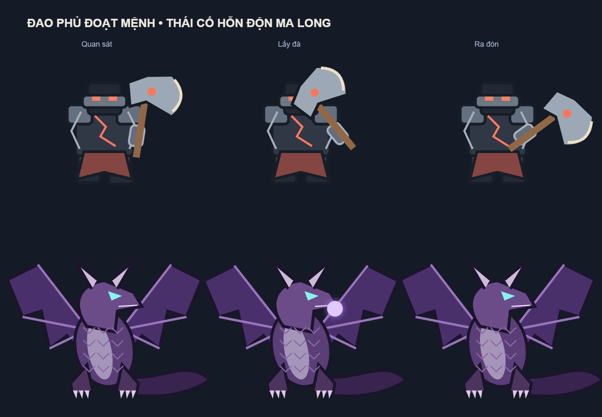
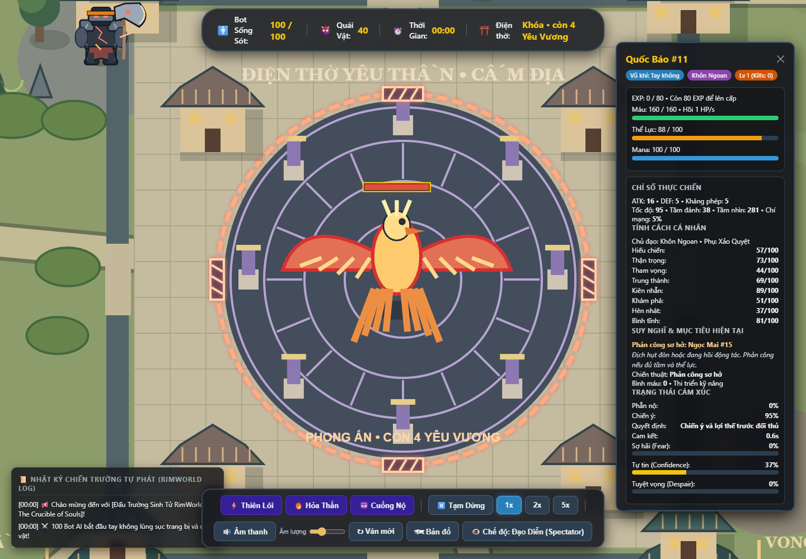

# Rework AI, kỹ năng và kiểm thử chống stuck — 08/10/2026

Đã triển khai các yêu cầu trong [plan](ai-combat-rework-plan-2026-10-08.md) trên source hiện có, không thêm dependency và không commit/push.

## Hành vi và quyết định

- Tám trục tính cách: hiếu chiến, thận trọng, tham vọng, trung thành, kiên nhẫn, khám phá, hèn nhát, bình tĩnh. Tính cách ảnh hưởng lựa chọn, độ nhạy cảm xúc, mức sẵn lòng phản kháng và cách học kỹ năng.
- Nhìn thấy bot ngang cấp/yếu hơn tăng chiến ý; đối thủ hơn ít nhất hai cấp thúc đẩy farm. Ba đòn tấn công độc lập từ cùng kẻ địch trong sáu giây và không có đường thoát kích hoạt quyết chiến. Đòn nhiều hit/DoT/phản sát thương không tính thành nhiều lần cấu rỉa. Bot có hèn nhát từ 85 không bị ép thức tỉnh. Không có xác suất bất tử để cứu bot.
- Đánh giá chiến lược theo nhịp 0,3 giây; giữ kế hoạch ít nhất hai giây và chỉ thay khi mục tiêu hết hợp lệ hoặc có lý do đủ mạnh. Phản ứng khẩn cấp vẫn xử lý nhanh. Bảng bot thêm chiến ý, lý do quyết định, thời gian giữ kế hoạch và trạng thái quyết chiến.
- Thượng Cổ giữ truy sát tới khi mục tiêu chết. Mất tầm nhìn chỉ đi tới vị trí cuối rồi tìm từng khu vực, không đọc tọa độ bot đã ẩn.

## Kỹ năng và phần thưởng

- 32 kỹ năng bot × ba bậc: hồi máu có thể ngắt, vùng hồi máu chỉ tác dụng trong phạm vi, khói che tầm nhìn thật, phản kiếm dùng một lần, khiên mana có tài nguyên riêng, đỡ theo hướng, phá giáp, chiêu bị ngắt khi đang chuẩn bị và các đòn nhiều đợt có tổng ngân sách sát thương.
- 42 kỹ năng chủ động quái có hiệu lực theo thiết kế riêng: đường/cone/vòng, vùng độc, hút, trói có thể cắt bằng khoảng cách/vật cản, bào tử tích lũy, lồng vật lý có lối thoát, đòn lao có va chạm, cảnh báo và sát thương chia đợt. Lâu La/Yêu Thú cũng có nhịp và cách tiếp cận theo loài.
- 30 chiêu Thượng Cổ: có vùng nguy hiểm/khe an toàn, cảnh báo khớp hướng đánh, ngân sách sát thương và khống chế; đòn bám mục tiêu có thể mất dấu. Bot né theo điểm thoát được giữ ổn định.
- Phản Chiếu hồi máu sao chép theo HP gốc của bot thay vì HP boss nhân 15. Lá chắn Zero Protocol đã giảm và có thể phá bằng sát thương thực.
- Vũ khí tốt hơn dưới chân được nhặt ngay kể cả đang đánh. Vũ khí trong 220 px, có đường khô và tới được trong ba giây được ưu tiên ngay trong combat; giữ kế hoạch/cụm combat. Đòn đang chuẩn bị hoặc projectile đã bắn giữ snapshot vũ khí cũ, không đổi sát thương giữa chừng. Thượng Bảo yếu hơn được giữ làm chiến lợi phẩm thay vì ép thay đồ mạnh.
- Yêu Thần chết bắt đầu đúng 20 giây mô phỏng. Bot có thời gian nhặt bộ trang bị mới; pause dừng countdown. Chết sớm vẫn đếm ngay, hết thời gian chờ điều kiện người sống sót/cấp 15/dọn Yêu Vương; không đếm lại lần hai. Khoảng cách giữa các boss tiếp theo vẫn 10 giây.

## Hình ảnh

Đao Phủ Đoạt Mệnh thêm giáp, mặt nạ, vải đỏ, vết nứt và lưỡi rìu rõ hình. Thái Cổ Hỗn Độn Ma Long có màng/cốt cánh, sừng, hàm, vảy, chân móng, đuôi và động tác tích lực. Tiếp tục dùng Canvas của game.

## Sửa lỗi đi vòng

Nguyên nhân tìm được: bot vẫn có bước dịch chuyển mỗi frame nhưng không tiến được về đích khi đường bị cụm combat đầy người chặn. Bộ kiểm tra cũ chỉ coi bước dịch chuyển bằng không là stuck; việc chọn lại đích roam tiếp tục làm bot vòng quanh cùng vùng.

Đã thêm đo tiến độ ròng trong thời gian thực sự di chuyển, điểm vòng tránh cụm được giữ hai giây, giữ đích chiến lược khi tìm lại đường, bỏ waypoint cuối trùng và phân tán thời điểm tìm lại đường giữa các bot. Tái dùng navigator/A* hiện có.

## Kiểm chứng

- Bản cuối có **104 test pass, 0 fail**, gồm regression bờ sông và một trận seed hoàn chỉnh; không skip.
- Production build thành công. Browser Edge chạy update/render source mới không có pageerror; HUD hiện “Thượng Cổ • 15s”, bot đã nhặt vũ khí Yêu Thần và boss chưa xuất hiện.
- Test đơn vị kiểm tra đủ 32 kỹ năng ở cả ba bậc, 42 kỹ năng quái, 30 chiêu Thượng Cổ; luồng năm boss/hai thanh HP/phần thưởng, cooldown, tầm nhìn, va chạm, nhóm combat, sinh tồn và snapshot khi loot.

### Mười trận có telemetry

Cả mười trận trước hai sửa nhỏ cuối đều kết thúc; SHA256 module được nạp: `ed0bcf1c63907d3157a8017052a2331757f5017cfbf2ea58f3bb7ee3113471ea`. Sau vòng này đã siết ngoại lệ hèn nhát ở nhánh phản công thường và sửa navigator khi đang bơi; không gộp các bản thành một fingerprint. Mỗi trận bắt đầu 100 bot/71 quái, chạy code thật trong VM với bước 0,1 giây tới popup người sống sót cuối cùng, giới hạn 45 phút mô phỏng. Lấy mẫu mỗi 0,5 giây trên cửa sổ bốn giây: mục tiêu, chuyển ý, vị trí, vận tốc, action, stun và đích đường đi. Cảnh báo được lưu nguyên bản, sau đó tái hiện để phân biệt đứng đánh/đỡ với stuck.

| Seed | Giây mô phỏng tới người sống sót | Cấp người sống sót | Cảnh báo | Vi phạm cụm combat hoạt động |
| --- | ---: | ---: | ---: | ---: |
| 42 | 756.2 | 13 | 0 | 0 |
| 17 | 533.3 | 11 | 1 | 0 |
| 5 | 853.4 | 21 | 0 | 0 |
| 11 | 382.9 | 11 | 1 | 0 |
| 23 | 398.6 | 7 | 0 | 0 |
| 37 | 495.6 | 11 | 0 | 0 |
| 53 | 582.7 | 12 | 0 | 0 |
| 67 | 799.8 | 15 | 1 | 0 |
| 71 | 775.3 | 16 | 0 | 0 |
| 91 | 420.2 | 9 | 0 | 0 |

Ba cảnh báo được giữ nguyên để đối chiếu:

- [Seed 17](stuck-review-seed-17.json): bot đứng đỡ, dùng chiêu và ra đòn khi có hai đối thủ. Phản ứng trong combat, không phải kẹt di chuyển.
- [Seed 11](stuck-review-seed-11.json): điểm nghẽn va chạm/cụm combat; tự thoát lúc 118,7s, đi hơn 80px khỏi vị trí cảnh báo ở 119,7s. Có chậm tạm thời, không có vòng lặp kéo dài.
- [Seed 67](stuck-review-seed-67.json): **lỗi thật** khi đang bơi cạnh ranh giới sào huyệt. Điểm thoát bị loại bởi yêu cầu đường khô; navigator hiện cho phép đoạn bơi để thoát nếu nhân vật vốn ở trong nước, vẫn kiểm tra va chạm/địa phận/giới hạn người. Fixture đúng tọa độ trước sửa chỉ dao động khoảng 8,6px, sau sửa đi 257px trong sáu giây, một lần phục hồi đường. Test hồi quy đã pass. Bản cuối kiểm tra lại cả trận seed 67 và bộ test đầy đủ; SHA256 source: `d83f24c120d3fc2b8da376c53b5a20adc70bdc5beccf677dc595745550afae78`. Trận seed 67 chạy lại trên đúng fingerprint này kết thúc sau **650,6 giây mô phỏng**: một bot cấp 12 sống sót, **0 cảnh báo stuck, 0 vi phạm cụm combat hoạt động**. Bộ kiểm thử bản cuối cũng chạy một trận seed 42 hoàn chỉnh và pass.

`largestGroup` trong JSON là số liên kết đang hoạt động truy ra từ cả nhân vật ngoài combat đứng gần các nhóm, có thể nối nhiều nhóm lân cận; kiểm tra vi phạm dùng riêng các nhân vật có combatLease. Không dùng số truy vấn này làm số người được phép tham gia một trận.

### Mười lượt tải đồ Thượng Cổ

[Telemetry](ancient-rework-loadouts.json): năm loại boss mở đầu, mỗi loại hai cấu hình. Không ghi nhận stuck; kiểm tra bot nằm trong đấu trường/vật cản đúng luật. Hai lượt hạ được boss đầu; chưa lượt nào thắng tự nhiên đủ năm boss trong cửa sổ tối đa 900 giây/lượt. Phản Chiếu giữ đặc tả 15× HP bot và vẫn rất khó. Test luồng có điều khiển chứng minh đi đủ năm boss và loot hoạt động; không được hiểu là đã chứng minh AI thắng chuỗi tự nhiên.

### Chi phí cập nhật AI

[Fixture đo](performance-rework.json) so sánh xen kẽ ba lượt trước/sau, mỗi lượt 120 tick đầu trận. Median p95 giảm từ 239,2 ms xuống 100,9 ms, khoảng 58%, sau cache ước lượng sức mạnh có invalidation và phân tán tìm đường. Baseline chỉ phục hồi snapshot các module AI/combat/Ancient/game/map trước lần rework, không phải checkout toàn bộ phiên bản lịch sử. Máy đồng thời chạy QA; đây là thời gian cập nhật trong VM, không phải FPS trình duyệt hay bảo đảm hiệu năng trên mọi máy.

## Chạy lại

~~~sh
rtk npm test
rtk npm run build
rtk proxy node tests/simulate-match.cjs 42,17,5,11,23,37,53,67,71,91
rtk proxy node tests/simulate-ancient.cjs
~~~

Mọi thay đổi nằm trong working tree; chưa stage, commit hoặc push.
