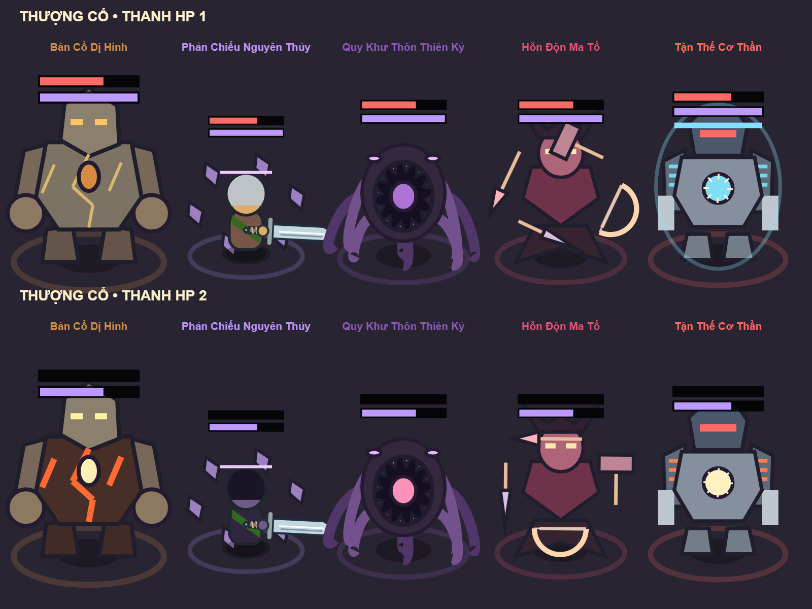
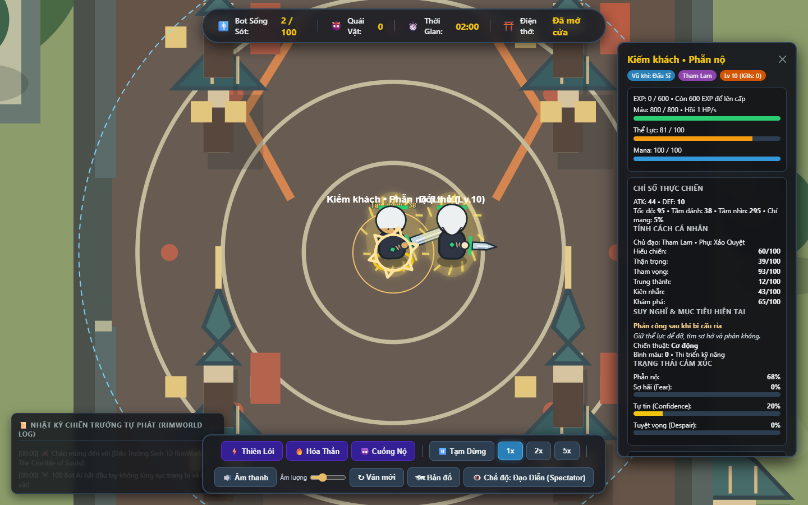

# Kiểm chứng AI, kỹ năng, Thượng Cổ và âm thanh — 08/10/2026

## Thay đổi đang có trong source

Bot chênh tối đa hai cấp có thể chọn đấu; khoảng cách từ năm cấp ưu tiên rút lui. Liên minh hai bot yếu hơn xét cơ hội cả cặp từ 40%, ưu tiên khi cùng nhìn thấy đối thủ mạnh hoặc chứng kiến chuỗi hạ sát. Không tìm tọa độ bot mất dấu bằng dữ liệu toàn bản đồ. Truy đuổi hữu hạn; đã thoát tầm nhìn thì dừng chạy khỏi kẻ ở xa.

Phẫn nộ tăng khi bị cấu rỉa nhiều lần, tạo ý định phản công trong sáu giây. Sợ hãi tăng có giới hạn theo mức sát thương; không cộng 20 điểm mỗi cú đánh của boss. Khi đường lui bị chặn, bot chống trả. Kế hoạch gần ngang điểm có ngưỡng đổi, chiến thuật và điểm lùi có thời gian giữ. Bot cấp tối đa chuyển sang tìm đối thủ khi còn tối đa năm bot, ngừng kế hoạch farm xa đang không giao tranh.

Không khóa nhánh vũ khí. Trang bị được so theo phẩm chất, ATK, tốc đánh, tầm đánh, DEF, HP, mana và tác dụng hỗ trợ; kỹ năng đã học được giữ khi đổi vũ khí. 32 kỹ năng chủ động có ba bậc, học/nâng theo sở thích và tính cách. Có thể học nhiều kỹ năng bậc thấp hoặc chuyên sâu ít kỹ năng. AI không bị giới hạn bốn kỹ năng; người chơi dùng Q/E/R/F cho bốn kỹ năng đầu.

Kỹ năng nhiều đợt chia ngân sách sát thương thành những đòn thực; có thể né đợt sau. Phản kiếm chỉ phản một đòn chính diện; khiên mana tiêu hao mana khi hấp thụ; phá giáp, kéo/đẩy, hồi máu, chảy máu, ảnh nổ và hỗ trợ đồng minh đều đi qua combat chung. Miễn khống chế và giới hạn người tham gia vẫn áp dụng. Bot có nhịp kỹ năng chung 1.8 giây, cùng cooldown và tài nguyên riêng. Bảng thông tin hiển thị mô tả bậc hiện tại, chi phí, ATK/DEF, EXP và phẫn nộ.

Mọi bot/quái sống hồi 1 HP/s; không vượt HP tối đa, không hồi khi tạm dừng hoặc đã chết. Yêu Thú và Yêu Tướng hồi sinh riêng từng bậc sau 10 giây kể từ khi bậc bị diệt sạch, đúng loài/sinh cảnh ban đầu. Các đợt dừng khi xác định người sống sót cuối; cơ chế thay bằng năm Yêu Vương vẫn được giữ.

Yêu Tướng trở lên chọn mục tiêu và chiêu theo khoảng cách/sơ hở, đọc đòn, giữ cự ly và bọc sườn. Nhịp phép chung: Yêu Tướng/Yêu Vương 3s, Yêu Thần 2s, Thượng Cổ 1s.

## Bậc Thượng Cổ

Hạ Yêu Thần thức tỉnh một trong năm boss tại đúng vị trí tử trận: Bàn Cổ, Phản Chiếu, Quy Khư, La Hầu và Zero Protocol. Mỗi boss có sáu nội tại, sáu chiêu, hai thanh HP và miễn khống chế. Các chiêu có cảnh báo, vùng tác động thật và va chạm; hiệu ứng phá địa hình và tường tạm ảnh hưởng đường đi.

Phản Chiếu sao chép trang bị, diện mạo, kỹ năng và mười nội tại được engine hỗ trợ. Kỹ năng sao chép dùng lại hiệu ứng gốc; combo nhiều đợt được ghi một lần mỗi lần thi triển. Khi phân thân, hai bản sao có nhịp phép chung của chủ thể, HP chủ thể đồng bộ với tổng HP hai bản sao, tính cả hồi máu. Boss Thượng Cổ chết ở phase hai kết thúc trận, không tạo loot/EXP.

## Âm thanh

Web Audio tổng hợp tiếng vũ khí, kỹ năng, đỡ/né, bước chân, bơi, uống bình, nhặt đồ, lên cấp, tử trận và chiêu boss. Có âm lượng/bật tắt, lưu lựa chọn trên máy. Chỉ phát sau tương tác người dùng; giảm âm theo khoảng cách và cân trái/phải theo camera, tối đa 16 tiếng đồng thời. Tạm dừng, kết thúc trận, tab ẩn và mute ngừng phát. Không tải tài sản âm thanh bên ngoài, không dùng RNG của gameplay để tổng hợp tiếng.

Kiểm thử trình duyệt đã tạo 14 loại tiếng, kiểm tra mute và đối tượng ngoài vùng nghe. Render âm thanh ngoại tuyến có 88.200 mẫu, RMS 0.00355 và peak 0.09434, xác nhận có tín hiệu và không clipping trong mẫu thử.

## Kiểm chứng

- Các bài test riêng: toàn bộ 32 kỹ năng × 3 bậc; cooldown/tài nguyên/khống chế; hồi máu và hồi sinh; lựa chọn breadth/mastery; phẫn nộ; điểm lùi/chiến thuật/kế hoạch ổn định; phân thân và combo; cap combat và âm thanh.
- Bản production cuối, seed 42: một bot ở 1.097,7s; tiếp tục farm năm Yêu Vương, hạ Yêu Thần, gặp Phản Chiếu và trận kết thúc khi bot bị hạ ở 1.408,4s. Không vượt cap/tụ đám sai luật/NaN trong các mẫu kiểm tra mỗi giây; không vi phạm nhịp chiêu trong 132 lần thi triển được theo dõi ở lượt cuối. Lượt kiểm tra trước còn xác nhận nhánh Bàn Cổ xuất hiện và trận kết thúc khi bot bị hạ.
- Trình duyệt seed 7: một bot ở 897,6s; seed 99: một bot ở 1.401,4s. Cả hai không ghi nhận vượt cap combat, tụ đám sai luật hoặc NaN trong các mẫu kiểm tra mỗi giây.
- Các lần chạy trình duyệt không có lỗi JavaScript được ghi nhận.
- Mô phỏng Node có thể khác trình duyệt do sai khác số thực và diễn tiến ngẫu nhiên. Với hồi máu/quái hồi sinh, kiểm thử cả trận cho phép tối đa 45 phút mô phỏng, vẫn kiểm tra cap xuyên suốt; không đặt giới hạn thời gian này vào game.
- Kết quả bộ kiểm thử đầy đủ: **86/86 pass**, gồm mô phỏng Node cả trận và các bài test hồi quy.
- Build production: thành công (28 module).

Tỷ lệ thắng của AI vẫn là ước lượng heuristic, không phải xác suất thống kê đã hiệu chỉnh từ hàng nghìn trận. Các seed trên kiểm chứng lỗi và tiến trình cụ thể, không khẳng định cân bằng hoàn hảo cho mọi tổ hợp.
