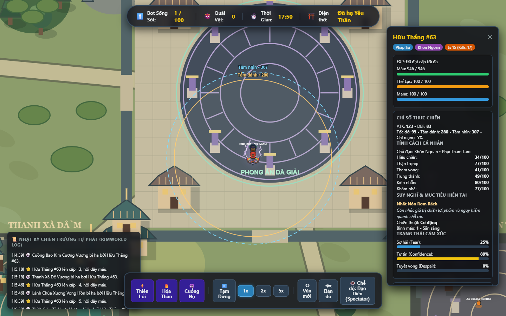

# Combat, liên minh chống áp đảo và nhặt đồ — 08/10/2026

## Đánh giá cơ chế liên minh

Ngưỡng 40% phù hợp cho một quyết định mạo hiểm có phối hợp, giúp chống lăn cầu tuyết mà không tự tăng chỉ số hay bảo đảm chiến thắng. Đây là mức **ước lượng cho cả cặp**, không phải 40% cho từng bot và không phải xác suất đã hiệu chỉnh bằng thống kê.

- Bot kết liễu ít nhất hai bot trong 60 giây tạo chuỗi hạ sát; giết quái không tính.
- Bot chứng kiến ghi nhớ kẻ hạ sát và vị trí cuối đã thấy. Hai bot gặp nhau có thể chia sẻ thông tin này và liên minh khi cả hai yếu hơn nếu đánh đơn, mức ước lượng cả cặp từ 40% và cụm giao tranh còn chỗ.
- Ý muốn liên minh tăng theo sự thận trọng, trung thành và chuỗi hạ sát đã biết; tối đa 90% mỗi lần cân nhắc, cách nhau 3 giây. Không tạo liên minh lớn hơn hai người.
- Liên minh kéo dài tối đa 25 giây; mất dấu quá 12 giây, một người chết, HP dưới 20% hoặc mức ước lượng dưới 35% thì giải tán. Chênh ngưỡng vào/ra tránh đổi ý mỗi frame. Nếu đang trong ngoại lệ bốn người, giữ hai cặp đến khi cuộc giao tranh kết thúc để không phá luật.
- Tuân thủ tối đa ba thực thể, hoặc bốn khi đúng hai cặp liên minh. Không dồn mọi bot vào một mục tiêu.

## Combat đã thay đổi

Bot phân biệt tự vệ, lùi chiến thuật và thoát thân. Hơi yếu hơn vẫn có thể đánh trả, chờ địch hụt đòn/hồi động tác hoặc phản công sau đỡ/né thành công. Máu nguy hiểm hoặc lợi thế quá thấp mới ưu tiên thoát hẳn; bị chặn đường vẫn chống trả.

Có nhịp thăm dò, gây áp lực, giả lùi qua chỗ che chắn, lùi hồi thể lực và phản công. Bot giữ kỹ năng theo tình huống, tránh phí khống chế vào miễn khống chế, chừa thể lực phòng thủ khi có thể, phối hợp bọc sườn và che đồng minh bị thương. Phản công không được cộng sát thương ngẫu nhiên. Tỷ lệ ước lượng xét cooldown, mana, stamina, tầm vũ khí, phòng thủ và địa hình.

Truy đuổi dừng khi quá thời gian/khoảng cách hoặc không gây được sát thương trong 9 giây. Mất dấu chỉ tìm quanh vị trí cuối trong tối đa 3 giây; ẩn thân đủ xa sẽ cắt truy đuổi. Kẻ săn không đi theo tọa độ mới của mục tiêu đã khuất tầm nhìn. Lùi chiến thuật diễn ra tại vùng giao tranh và có nhịp trở lại gây áp lực; không chạy khỏi boss ở xa chỉ vì điểm ước lượng hơi thấp.

Bảng bot hiển thị chiến thuật đang dùng, đồng minh và mục tiêu liên minh.

## Nguyên nhân bot bỏ đồ và cách sửa

1. Kế hoạch săn/đấu đang chạy không nhường cho đồ mới rơi; điểm đấu thường cao hơn điểm loot. Đồ hữu ích dưới chân được nhặt ngay khi bot có thể hành động; nâng cấp an toàn có thể ngắt kế hoạch để đi nhặt.
2. So cùng bậc chỉ dựa vào một chỉ số, bỏ qua tốc đánh/tầm đánh/HP. Hàm dùng chung đánh giá sát thương thực dụng, tốc độ bị giới hạn bởi cooldown, tầm đánh, DEF, HP, mana, chí mạng, miễn khống chế và hồi sinh đang được hỗ trợ; không đổi sang món xấu hơn chỉ vì phẩm chất cao.
3. Chặn đồ trong sào huyệt theo cấp cứng kể cả sào huyệt đã dọn. Quyết định lấy đồ dùng chung luật di chuyển, nên nhặt được khi khu vực đã mở.
4. Bot cấp 15 ưu tiên Yêu Thần trước đồ tốt/bình gần đó. Người sống sót lấy nâng cấp an toàn và dùng bình đang sở hữu trước khi quyết chiến.

Khóa nhánh vũ khí vẫn được tôn trọng: bot bỏ vũ khí không phù hợp nhánh là hành vi có chủ đích. HP vẫn chỉ hồi từ lên cấp, bình nhặt được hoặc kỹ năng.

## Kiểm chứng

- `npm test`: **64/64 đạt**, 0 lỗi; thời gian 219,64 giây. Có kiểm thử nhặt đồ ngắt kế hoạch, tốc đánh/HP, sào huyệt đã dọn, tự vệ, phản công, dự trữ tài nguyên, mất dấu, thông tin được chứng kiến, ngưỡng liên minh 40%, giới hạn combat và hướng dịch chuyển thoát thân.
- `npm run build`: thành công, 24 module; bản production JS khoảng 211,09 kB (gzip 70,15 kB).
- Edge chạy bản production, seed 42, bước 0,1 giây, đủ 100 bot/71 quái: tìm được người thắng **Hữu Thắng #63** ở **826,6 giây**. Trước popup có **74 lượt nhặt/thay trang bị**, 10 lượt nhặt bình, **461 lượt ra đòn/kỹ năng phản công** và **7 liên minh chống áp đảo** tự hình thành.
- Kiểm tra cụm combat và tụ đông mỗi 10 bước: tối đa ba trong trận này, **0 vi phạm**. Ngoại lệ hai cặp/bốn người được xác minh bằng test riêng.
- Click nút tiếp tục thực tế: người thắng farm hết năm Yêu Vương, đạt cấp 15 rồi hạ Yêu Thần ở **1065,5 giây**, còn 729 HP. Sau nhặt đồ/dùng bình: 946/946 HP; tổng 77 lượt trang bị và 16 lượt bình trong cả trận. **0 lần nhắm Yêu Thần khi chưa đủ cấp hoặc còn Yêu Vương, 0 lỗi JavaScript**.
- Đây là một trận kiểm chứng, chưa chứng minh phân phối thắng/thua cân bằng trên mọi seed. Ngưỡng 40% là điểm đánh giá chiến thuật và có thể thua thực tế.
- Không commit hoặc push.

[Thông số kiểm chứng JSON](combat-coalition-evidence-2026-10-08.json)

