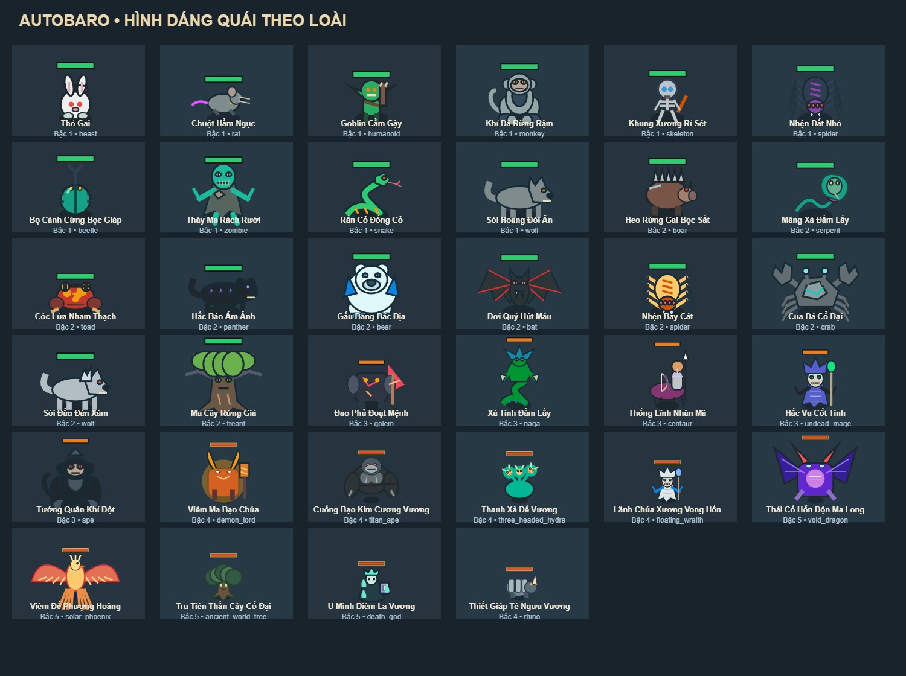
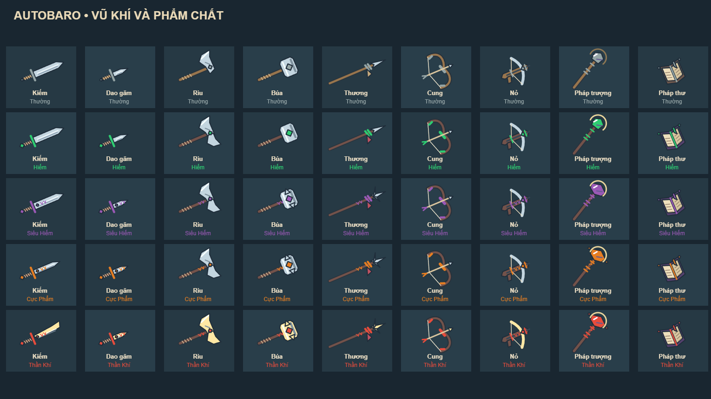
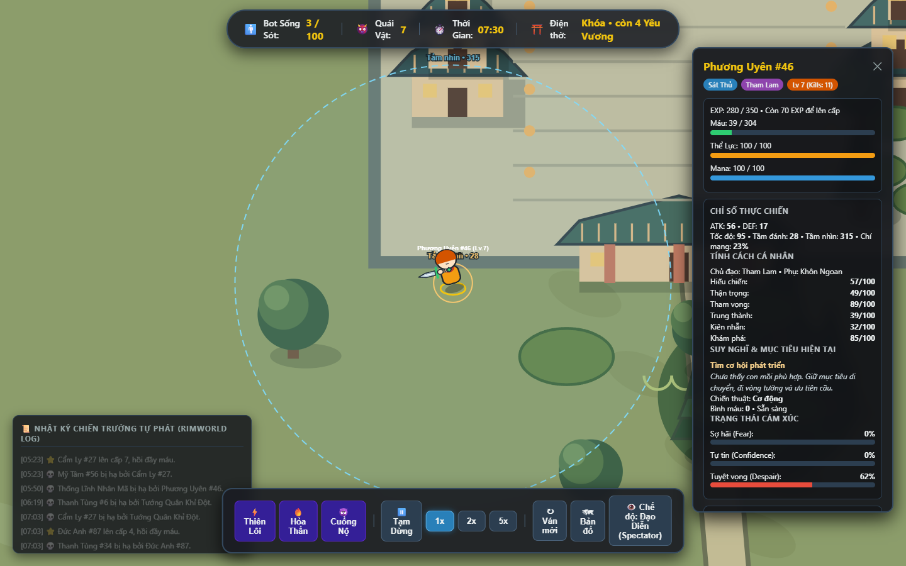
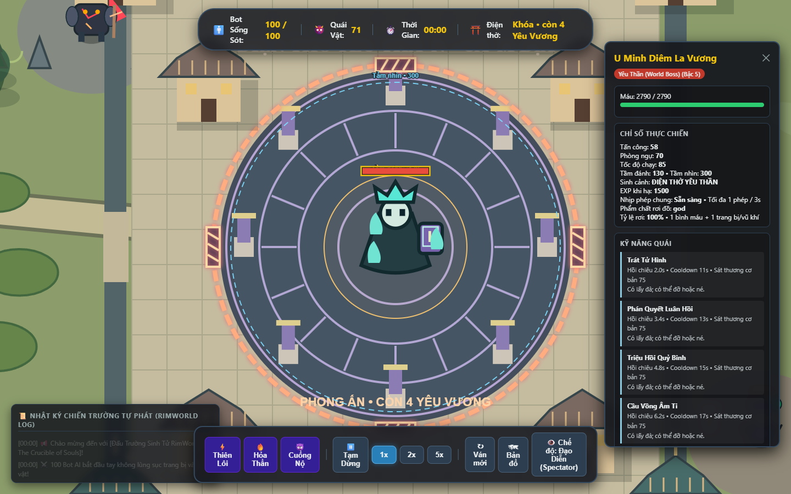
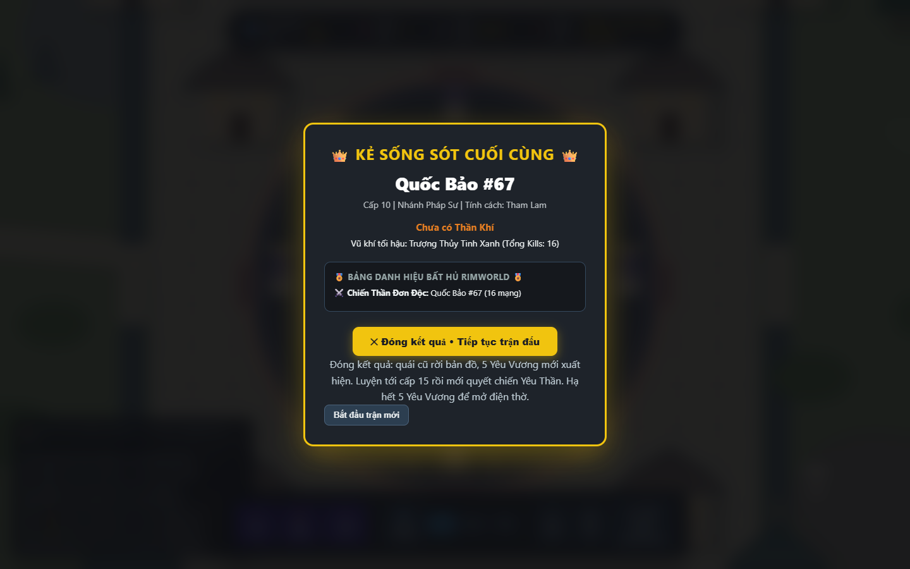
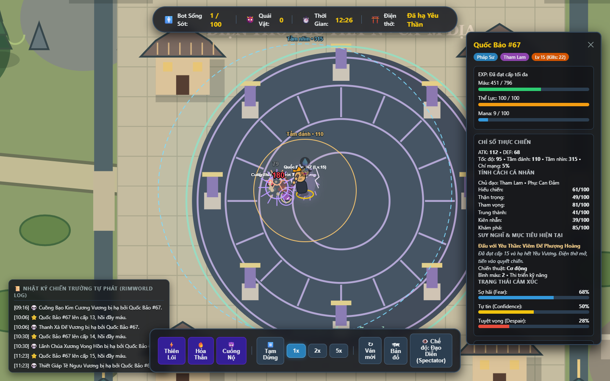

# Cập nhật chiến thuật, phong ấn và hình ảnh — 08/10/2026

## Luật và AI hiện tại

- Xóa module vòng bo, phần cập nhật, sát thương và lớp vẽ; HUD chuyển sang trạng thái điện thờ.
- Combat tối đa 3 thực thể. Ngoại lệ 4 chỉ gồm đúng hai cặp bot liên minh hai chiều. Các cặp giao tranh nối nhau trong bán kính 120 cũng tính cùng trận; kiểm tra áp dụng khi ra đòn, thi triển và gây sát thương.
- Bot bị chặn khi tiến vào đám đông quá 3 bot trong bán kính 75; hai cặp liên minh được phép 4. Kiểm tra cả vị trí thực tế sau khi trượt dọc tường, quái còn thời gian combat và cụm gốc của người đang di chuyển. Bot chọn mục tiêu khác khi cụm đã đủ người.
- Điện thờ có vòng phong ấn vật lý và bốn cổng hiển thị rõ. Chặn đường đi, né/lướt/teleport, đạn và sát thương. Chỉ mở sau khi không còn Yêu Vương sống. Khi lượt farm cuối sinh 5 Yêu Vương mới, điện thờ khóa lại cho đến khi cả 5 chết; bot còn phải đạt cấp 15 mới chọn Yêu Thần.
- Ngưỡng bắt đầu săn từ 50% thắng, phụ thuộc tính cách và cảm xúc. Bot không bỏ dở một cuộc săn còn khả thi chỉ vì xác suất giảm nhẹ khi áp sát: tiếp tục nếu còn trên 20% HP, còn trong combat và xác suất ít nhất 40%.
- Bot gặp đối thủ yếu hơn ưu tiên giao tranh khi không quá sợ hãi/tuyệt vọng. Nước rút tăng tốc 25% và tốn thể lực; có dự đoán hướng chạy để chặn đường. Bỏ truy đuổi sau khoảng 10–16 giây hoặc xa hơn 1,8 lần tầm nhìn; bỏ qua cùng mục tiêu trong 20 giây.
- Bot yếu ưu tiên tẩu thoát, dùng skill hỗ trợ sẵn sàng rồi tìm bụi có đường rút. Ẩn thân/ngụy trang thực sự cắt khả năng phát hiện và truy đuổi, bị phát hiện ở cự ly sát người hoặc khi tấn công/bị đánh. Bot nhát/gian xảo có thể rình 6–14 giây trong bụi, phục kích mục tiêu bị thương khi trận còn chỗ, sau đó đổi kế hoạch.
- Quái chủ động phát hiện người chơi và bot trong tầm nhìn, có kiểm tra tường và ẩn thân. Chúng áp sát tới biên sinh cảnh; không đi vào địa bàn boss khác. Giữ nhịp phép chung 3 giây và luật Yêu Tướng không đánh hội đồng.
- Cân bằng riêng lượt farm cuối cho cả bot cận chiến và đánh xa; vẫn chỉ hồi HP bằng bình, lên cấp hoặc skill.

## Hình ảnh và focus

- Mọi kiểu quái đang khai báo có hình riêng; không còn dùng hình tròn dự phòng cho các loài đã có dữ liệu. Bổ sung khỉ, nhện tám chân, sói, báo, gấu băng, dơi, cua đá, ma cây, zombie, rắn, xà tinh, pháp sư xương và lãnh chúa vong hồn. Thêm mặt, nanh, sừng, chân, vảy/giáp và chi tiết boss vào các mẫu cũ.
- Thanh máu đặt phía trên điểm cao nhất của từng dáng quái, tránh che đầu/sừng.
- 9 họ vũ khí có hình lưỡi/chuôi/dây/tinh thể/trang sách riêng, chi tiết theo phẩm chất và biến thể hình dáng. Dùng chung hình vũ khí cho cầm trên tay, đỡ đòn và đồ rơi. Giữ animation lấy đà → tiếp xúc → hồi chiêu, không quay vòng vũ khí.
- Focus hiển thị vòng vàng = tầm đánh thường và vòng xanh đứt nét = tầm nhìn; bảng thông tin có cùng thông số thực tế. Ẩn nấp được biểu thị bằng thân người mờ.

## Kiểm chứng

- **51/51 kiểm thử Node đạt** (lượt toàn bộ cuối: 130,9 giây). Bản production build thành công bằng Vite.
- Kiểm thử Node bao gồm luật 3/4 người, không đánh hội đồng, cooldown, cửa điện thờ, đường đi/đạn, xác suất 50%, chase timeout, trốn/ẩn thân, phục kích, quái aggro người chơi, các renderer và hai lượt farm bằng cận chiến/đánh xa.
- Test trận đầy đủ hiện cho tối đa 30 phút mô phỏng thay cho 15 phút trước đây: bỏ vòng bo có thể làm trận lâu hơn. Test vẫn yêu cầu tìm được người thắng và kiểm tra các giới hạn tụ đám/cụm liên thông trong trận.
- Trình duyệt Edge, seed 42, bước 0,1 giây: 100 bot / 71 quái. Người thắng Quốc Bảo #67 ở cấp 10, popup lúc **515,3 giây**. Sau khi bấm nút đóng popup, người thắng hạ đủ **5 Yêu Vương**, đạt **cấp 15**, hạ **Viêm Đế Phượng Hoàng** lúc **746,2 giây**; còn 451 HP.
- Đo mỗi 10 bước trong trận sinh tồn: tối đa 3 thành viên combat, tối đa 3 bot cùng khu vực; **0** vi phạm nhóm, **0** vi phạm cụm liên thông, **0** vi phạm tụ đám. Có ghi nhận cả ẩn nấp và truy đuổi.
- Lượt farm cuối: **0** lần chọn Yêu Thần sớm, **0** lần vào điện thờ khi còn Yêu Vương; nhóm combat tối đa 2.
- **0 lỗi JavaScript** trong lượt chạy production. Số đo này là bằng chứng của seed đã chạy; những trận ngẫu nhiên khác có thể có thời lượng và người thắng khác.
- Không commit, stage hay push. Mọi thay đổi để ở working tree.

[Dữ liệu mô phỏng](tactics-visual-evidence-2026-10-08.json)

