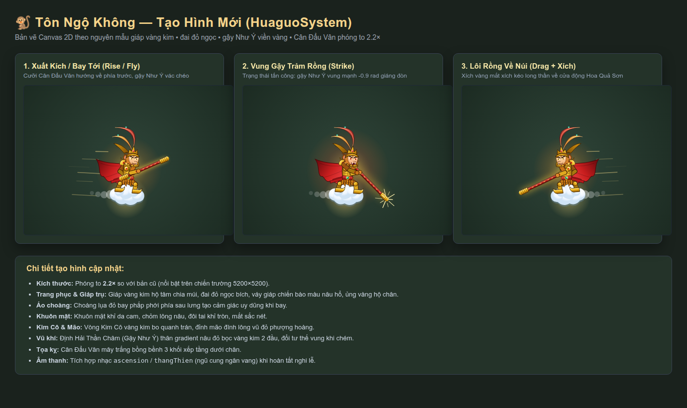

# Báo Cáo Tạo Hình Tôn Ngộ Không (HuaguoSystem) & Âm Thanh Thăng Thiên

- **Ngày thực hiện:** 09/10/2026
- **Branch:** `dev/truongdb`
- **Ảnh báo cáo:** [wukong-2026-10-09.png](wukong-2026-10-09.png)
- **File preview:** [wukong-sheet.html](wukong-sheet.html)

---

## 1. Yêu Cầu Cập Nhật
1. **Tạo hình Tôn Ngộ Không:** Thiết kế lại đẹp hơn, chi tiết hơn và tăng kích thước (to hơn) theo nguyên mẫu:
   - Giáp vàng kim hộ tâm, chia múi giáp sắc nét.
   - Choàng đỏ tung bay sau lưng.
   - Đai lưng đỏ đính ngọc bích, váy giáp nâu, ủng vàng.
   - Đầu lông khỉ, mặt khỉ tròn, đôi tai vểnh, đuôi khỉ uốn lượn.
   - Vòng Kim Cô vàng kim bo sát trán, lông vũ đỏ trên mão.
   - Định Hải Thần Châm (gậy Như Ý) gradient vàng - nâu đỏ bọc vàng kim 2 đầu.
   - Cân Đẩu Vân mây trắng bồng bềnh dưới chân mở rộng tương xứng.
2. **Âm thanh Thăng Thiên:** Kích hoạt audio khi 5 bot hoàn thành nghi lễ bái kiến tại Núi Hoa Quả Sơn trước khi Ngộ Không xuất kích tiêu diệt rồng.

---

## 2. Ảnh Chụp Trực Quan Các Tư Thế (Report Preview)



### 3 Trạng Thái Hiển Thị:
1. **Xuất Kích / Bay Tới (`rise` / `fly`):**
   - Cưỡi Cân Đẩu Vân lao về phía mục tiêu long thần với tốc độ 520 px/s.
   - Gậy Như Ý vác chéo góc nghiêng `+0.5 rad`.
2. **Vung Gậy Trảm Rồng (`strike`):**
   - Khi tiếp cận long thần trong phạm vi 40 px.
   - Gậy vung ngược góc `-0.9 rad` giáng đòn dứt điểm trước khi rồng tan biến.
3. **Quay Trở Về (`return`):**
   - Sau khi tiêu diệt rồng, Đại Thánh đổi hướng bay trở về Hoa Quả Sơn nghỉ ngơi, mây rẽ theo góc lùi.

---

## 3. Thay Đổi Code Cụ Thể

### A. Tạo hình Canvas 2D (`js/entities/huaguoSystem.js`)
- Tỉ lệ scale tăng lên **2.2×**: `ctx.scale(facing * 2.2, 2.2)`.
- Bổ sung áo choàng đỏ bay phấp phới (`quadraticCurveTo`).
- Giáp ngực vàng kim kẻ viền chia ô hộ tâm, đai đỏ ngọc tròn, váy giáp chiến bào và ủng vàng.
- Đầu khỉ chi tiết: chỏm lông nâu, tai đôi bo tròn viền đậm, mặt bầu bĩnh, mắt đen, khuôn miệng mỉm cười.
- Vòng Kim Cô vàng kim ôm trán, lông vũ đỏ trên đỉnh mão vút cao.
- Đuôi khỉ uốn lượn tự nhiên.
- Gậy Như Ý bọc bịt vàng 2 đầu, thân gậy gradient kim loại sang trọng.

### B. Hào quang & bắt rồng (`js/entities/huaguoSystem.js`)
- Hào quang vàng kim quanh thân + quanh gậy khi `strike`.
- Không giết rồng. `strike` gọi `captureDragon`: rồng `captured`, Ngộ Không state `drag`, kéo rồng theo sau (cách 70px, tốc độ 420).
- Về núi: `imprisonDragon` — rồng `isAlive=false`, `vx=vy=0`, vào `capturedDragons`, gỡ khỏi `AliothSystem.dragons`. `drawCaptives` hiện số long thần nhốt cạnh động.
- `aliothSystem.update`: bỏ qua rồng `captured` (không bay, không nuốt).
- Về núi xong: `this.clouds = []` xóa vệt mây.

### C. Âm Thanh Thăng Thiên (`js/engine/audio.js` & `huaguoSystem.js`)
- Bổ sung công thức âm thanh procedural Web Audio:
  ```javascript
  T.ascension = R(.6,
    arp([294, 330, 392, 440, 523, 659, 784], .16, .9, .09),
    o('sine', 147, 294, 2.6, .12),
    o('triangle', 196, 392, 2.4, .05, .3),
    n('bandpass', 600, 1800, 1, .8, .04, .2),
    b(784, 2, .06, 1.3)
  );
  ```
- Đăng ký `ascension` & alias `thangThien` vào `PRIORITY` và `UI` để phát toàn bộ map không bị dìm âm lượng hay hạn chế bởi camera.
- Kích hoạt trong hàm `summonWukong()` ngay khi gom đủ 5 pilgrims bái kiến.
